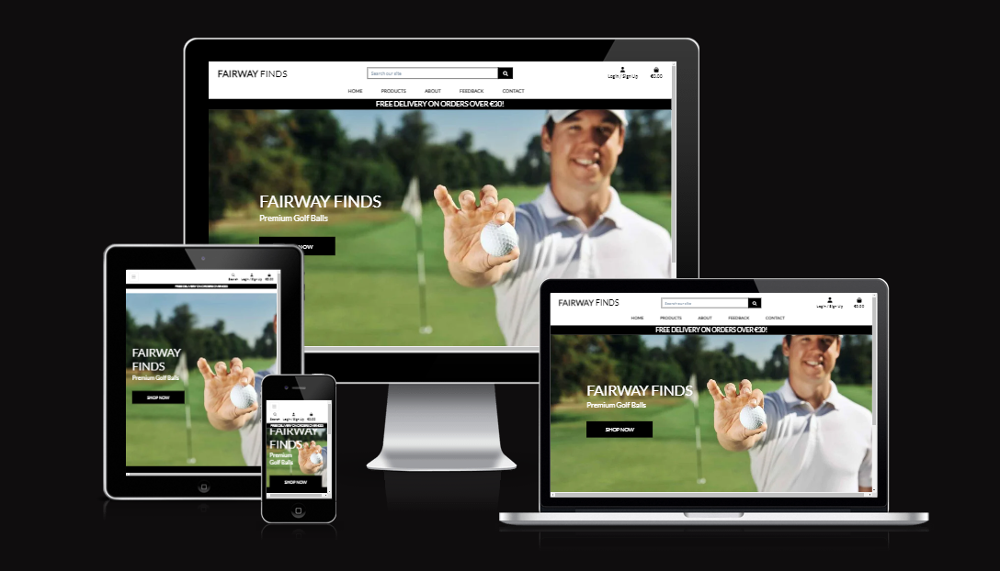
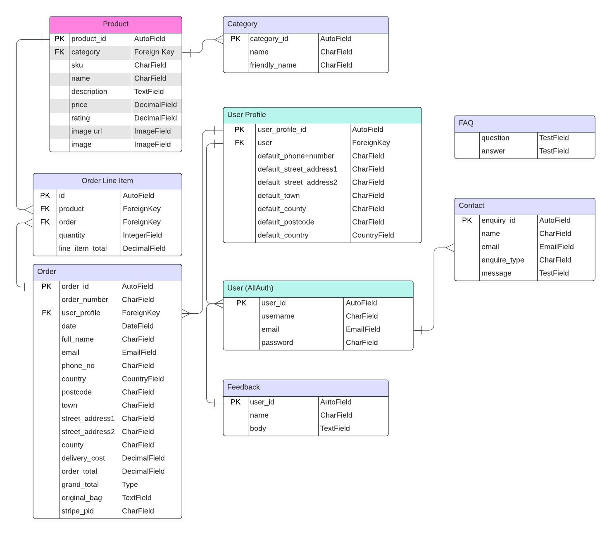
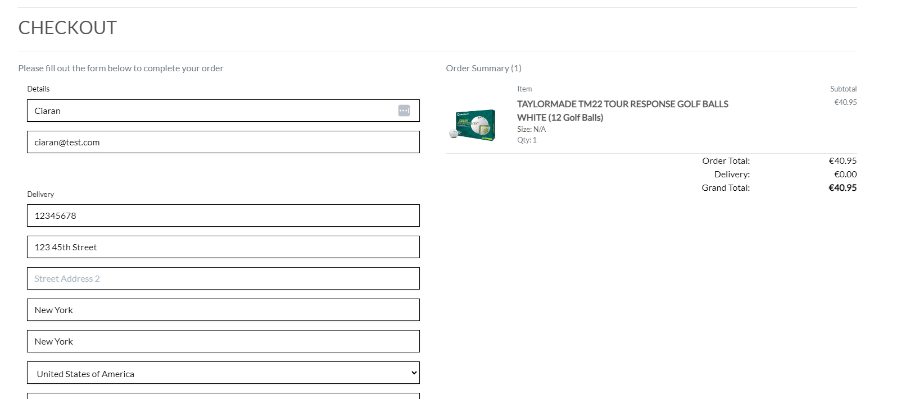
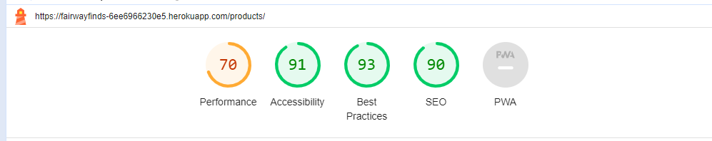

# Fairway Finds



## A store providing premium and discounted golf balls .
> A Golf Ball selling e-commerce website that provides goods for sale.


### - By Patrick Grant

## **[Live site](https://fairwayfinds-6ee6966230e5.herokuapp.com/)    |    [Repository](https://github.com/PatrickG0308/PP5-FairwayFinds)**

---
  
## Table of contents
<a name="contents">Back to Top</a>
 1. [ UX ](#ux)
 2. [ Business Model ](#biz)
 3. [ SEO ](#seo)
 4. [Agile Development](#agile)
 5. [ Features ](#features)  
 6. [ Features Left to Implement ](#left)  
 7. [ Technology used ](#tech) 
 8. [ Testing ](#testing)  
 9. [ Bugs ](#bugs)  
 10. [ Deployment](#deployment)
 11. [ Credits](#credits)
 12. [ Content](#content)  
 13. [ Acknowledgements](#acknowledgements)  

---

## UX

<a name="ux"></a>

### Database Schema

<details>
<summary> Database Structure</summary>
<br>

This was the suspected preproject planning database structure. As the project was being developed changes were made to the final project due to time contraints and project scope.


</details>


## UX design

### Wireframes

<details>
<summary> Home Page </summary>
<br>


</details>

<details>
<summary> Products </summary>
<br>


</details>

<details>
<summary> Product Detail </summary>
<br>


</details>

<details>
<summary> About Us </summary>
<br>


</details>

<details>
<summary> FAQs </summary>
<br>


</details>

<details>
<summary> Feedback </summary>
<br>


</details>

<details>
<summary> Contact </summary>
<br>


</details>

<details>
<summary> Bag </summary>
<br>


</details>

<details>
<summary> Checkout </summary>
<br>


</details>

<details>
<summary> Complete Order </summary>
<br>


</details>


[Back to Top of page](#contents)

---

# Business Model

<a name="biz"></a>

#### Business Overview

The business is a B2C e-commerce platform whose goal is to provide quality products to it's customers through an online store.

The types of products would be premium golf balls for the discerning golfer at very reasonable prices, and discounted second hand balls
also know as lake balls and practice balls for continuous use.

The benefits for the business owner are:

1. Easy to scale the business as it grows
2. No need to set up a physical location
3. Can cater to customers globally
4. Can target a specific niche and try to build a brand that resonates with its target audience.
5. Relatively low cost in starting up which allows for a larger portion of the budget to be used for customer aquisition. ie Ads / marketing
6. Low price point would encourage impulse buying from customers who may be considering purchasing from the business.


The cons of this business model are:

1. Getting customers initally can be difficult due to saturation in certain industrys
2. Establishing a brand from the ground up takes time and immediate results are unlikely without a sound marketing strategy.
3. Getting customers organically takes time so the business would need to manually market the business or use paid advertising.
4. Not having a physical business can make it harder to build trust and loyalty with customers without offering discounts and promotions.
5. As the price point for the items is lower, the business would need to process a reasonable number of orders per day / week / month for the business to be viable.

Taking the pros and cons of this business, a subscription model seems to be an unlikely viable model initially as it requires a customer base and some form of brand loyalty.

The best approach would be to provide products on a pay as you go traditional e-commerce format. As the business grows then the implementation of a subscription model would make more sense allowing members to avail of increased discount levels.

---

#### Site User
User 1: The typical site user would be a male aged between 20 and 60 who has an interest in golf, and improving their golf through practice. 

User 2: Additional site users could be partners of user 1 and may be browsing the site to purchase gifts for them.

User 3: Corporate entities who may wish to advertise by adding their logo to golf balls for distribution to existing and potentially new customers

---

####  Goals for the website
The goals for the website are:
- An easy to navigate website with clear purpose
- Provide users with products that meet their expectations
- Allow users to view, read and comment on products and service through the feedback app.
- Allow users to checkout quickly and easily
- To allow users to create a profile to view past orders and update profile information

---

#### Marketing Strategy
The businesses marketing strategy going forward is:

1. Promote the store through it's facebook business page. This can be viewed in the SEO section.
2. Share the page with friends and family and ask them to like it and share the path to their wider circle.
3. Have a soft online launch sale to encourage early adoption and purchases from prospective clients
4. Gain subscribers through the mailchimp option on the site and then send out offers and promotions to encourage repeat business
5. Potentially use paid advertisement like google ads, facebook ads to promote to our target demographic.
6. Set up multiple ads with a different product as the cover image, track the click through rate and stick with the high peformers.
7. Depending on budget the business may look at promoting it's products through influencers, offering complimentary goods or a small fee for a shout out or review. Ideally targeting low to medium influencers with a following of at least 10k. This would be realistic with a low budget for the business starting off and can start pushing traffic towards the site. 

[Back to Top of page](#contents)

---

# SEO

<a name="seo"></a>

### SEO Project planning

Once the business model was decided I started working on how to market the site and what keywords to target.
I utilised google trends to find more popular search terms and also used a tool called SEO quake to compare the competition and see what they are doing well.
I checked for a number of keywords on wordtracker.com and signed up for a trial to get as much out of it as possible. From there I developed a list of short tail and long tail keywords I intended to use in this project.

### Keywords

Short-tail - Discount Golf Balls, Clearance golf balls, 
Cheap, Premium Golf balls, Special Offers on Golf Balls,
Free Shipping Golf Balls, Exclusive Golf Ball Promotions, Weekend Golf Ball Sale, 
Low Price Golf Balls, Special Offers on Golf Balls, 
Buy One Get One Free Golf Balls, Bulk Golf Balls Saleon golf balls

long-tail -  Huge savings on premium golf balls, Lowest prices guaranteed on golf balls, 
Exclusive discounts on top-brand golf balls,Free shipping on all golf ball orders, 
Save big on multi-pack golf ball bundles, Premium golf balls at discount prices, 
Great deals on high-quality golf balls, Score big savings on golf balls

By utilising the short tail keywords and analysing the results from google trends, and the related questions I was able to generate a list of longtail keywords.
The keywords are used throughoutn the site at different places.

I make use of the <strong>Strong</strong> tag where necessary and ensure all links are described correctly.

### Sitemap.xml
I generated a sitemap for the site so that once ready engines like google can search it effectively.

### Robots.txt
I generated a robots.txt file so that google could crawl the site. I have blocked off the accounts app as there is no benefit for google to crawl those pages.

### Logo
For the favicon and logo for facebook I needed to manually create a logo to fit the theme of the store.

I created a custom logo in Hatchful by Shopify. This logo was created using the base color scheme and includes the initials of the store.

This logo can be seen in the favicon of the site and on the facebook screenshots below from the business page.

### Facebook Business Page

To view the facebook business page you can click on the link below:

[Facebook Business Page](https://www.facebook.com/profile.php?id=61557285765026)

In case the page becomes inactive or deactivated by Facebook I have taken screenshots to display here also:

<details>
  <summary>Facebook Business Page Screenshots</summary>
  <br>


</details>

[Back to Top of page](#contents)

---

## Agile Development

<a name="agile"></a>

### Agile Overview
Once I had an initial idea of the website I was going to build I started the preplanning by creating a github projects page to track the epics, user stories and tasks required to work through for this project.

It gave me an idea of how long this project was expected to take and how to manage my workload effectively.

As I worked through the workload I moved stories from not started to in progress to completed once the story was completed successfully. Occasionally I would find other work that were either new story or an extra to an existing story that required attention before completing a larger task.

One of the sections in my project boards is called Nice to Have. This is usually for expanding the project beyond MVP and adding additional features to enhance user experience.

### Github Project Board
To see the final project board for Fairway Finds you can click the link below:
[Fairway Finds Project Board](https://github.com/users/PatrickG0308/projects/15)


#### Epics

 1. [Epic: User Interaction](https://github.com/PatrickG0308/PP5-FairwayFinds/milestone/5)
 2. [Epic: User Account and Profile](https://github.com/PatrickG0308/PP5-FairwayFinds/milestone/1)
 3. [Epic: User Navigation](https://github.com/PatrickG0308/PP5-FairwayFinds/milestone/6)
 4. [Epic: Sorting and Searching](https://github.com/PatrickG0308/PP5-FairwayFinds/milestone/2)
 5. [Epic: Purchasing](https://github.com/PatrickG0308/PP5-FairwayFinds/milestone/3)
 6. [Epic: Admin and Store Management](https://github.com/PatrickG0308/PP5-FairwayFinds/milestone/4)

Each Epic may have one or more user stories associated and each user story may have tasks.

The full breakdown of user stories and tasks are included on the project board above.

Due to time contsraints some aspects of the project were deemed not mandatory and moved into the Nice to Have column. 

These remain unfinished and can also be viewed from the project board. This would give an indication of the direction the site would move in going forward.

[Back to Top of page](#contents)

---

## Features

<a name="features"></a>

<details>
<summary> Navigation </summary>
<br>

The Desktop navigation was based on Boutique Ado and seemed like a concise and clear option for an e-commerce store. 


Mobile Navigation
  


Mobile Navigation - Expanded


  
When developing this application I decided I wanted to add a detailed footer as would be found on most e-commerce websites.


</details>

<details>
<summary> Authentication </summary>
<br>

The authentication flows come from Allauth and have been styled to fit the theme of my website. At present when a user signs up a confirmation email is sent to their email address to confirm it before being able to access their account. 

Registration Page


Verification Email Sent


Verification Email recieved by customer


Verification Confirmation 


Sign In Page


</details>

<details>
<summary> Products Page </summary>
<br>

The products page is responsive to allow equal spacing between products regardless of screen width.
  
  


</details>

<details>
<summary> Bag & Checkout Flow </summary>
<br>

Add Products to Bag


Add checkout page a customer who has not signed is allowed to purchase the product once information form has been completed
and correct payment details entered. A logged in user would have their information pre populated from their profile information.




Once the customer makes a successful payment they are redirected to the payment success page where they see a summary of their order. 


  


</details>


<details>
<summary> Account Profiles </summary>
<br>

The account profiles app was designed to make it easy for customers to carry out some basic post order options
such as update their account information with correct address or email information.


The customer can visit their order confirmation by clicking on the order number in the order history page. Once directed to this page they will be notified by a pop up message that this is displaying a previous order and not a new one.
  
The customer can return to the profile by clicking on the button below the order form.


</details>

<details>
<summary> About </summary>
<br>

The About Us page outlines the online stores vision and inspriation to allow customers to get a feel for the value and quality of our products and service.  


FAQ's pages answers to basic commonly asked questions about our products and what we do.


  
</details>

<details>
<summary> Feedback </summary>
<br>

The feedback form is to provide customers the oppurtunity to comment on the quality of the products and service offered.
This option is only available to authenticated customers, customers are allowed to add, edit, and delete their feedback. 


Feedback Add 


Feedback Edit


Feedback Delete


  
</details>

<details>
<summary> Contact Page </summary>
<br>

The contact form offers customers a medium to contact the site owner directly. It offers a choice of what type of enquiry
it is related to through a dropdown menu option. If customer is authenticated the E-Mail field is automatically populated 
with the e-mail provided in the customers profile.

Contact form with the auto populated email


Enquiry types offered to customers.


</details>


<details>
<summary> Account Notifications </summary>
<br>

When a user signs in or out they see a notification like the below to indicate this with the relevant action just taken.

Sign in notify


Sign out notify


If a user navigates to their account profile and selects an order number they are imformed that they are looking 
at a past order.


When a user adds an item to cart they see the below notification.
  


When a user removes\updates an item in the cart they see the below notifications.
  


When a user updates their profile information


When a user completes a successful order


When a user successfully submits feedback


When a user successfully subscribes to mailchimp


</details>

<details>
<summary> Admin related permissions </summary>
<br>

When the superuser logs into the account they have additional front end permissions to edit, delete and add products to the website.
The edit option and delete options are available on the products page and the add product option is on the product management page on the my account dropdown.


Superusers can also view all orders received


Superusers can also view any contacts made by customers and respond.


</details>

<details>
<summary> Error Pages </summary>
<br>

Custom Error Pages were created to give the user more information on the error and to guide them back to the site


- 400 Bad Request - Fairway Finds is unable to handle this request.
- 403 Page Forbidden - Looks like you're trying to access forbidden content. Please log out and sign in to the correct account.
- 404 Page Not Found - The page you're looking for doesn't exist.
- 500 Server Error - Due to an internal error we are unable to process this request.

</details>


#### Account restrictions:

When an unverified or not logged in user trys to access the accounts section of the site they are notified they do not have permissions and then redirected back to home.

For the short term and to prevent spam, when a non logged in user trys to access the contact form page they are advised to login and redirected back to the home page. This was a personal choice and by design but in the next iteration I would add a "honey pot" type input that is hidden from the front end user. If this option is checked then it would be prevented from being submitted as it would show signs of spam / bot activity.


[Back to Top of page](#contents)

---

<a name="left"></a>
## Features left to Implement 

#### Subscriptions
My intention for this project was to implement subscriptions but due to time constraints it became unrealistic to implement them effectively. This will be one of the first options I intend to include upon developing this project further.

#### Frequently Bought Items
In future iterations I would implement a Frequently added products section that would present itself on the initial bag page before checkout to help drive upsells.

#### Product Reviews
At present the products have a fixed rating set by the site admin which is not a true reflection of customer satisfaction. In the next iteration customers would be able to leave reviews on products they have successfully purchased once they are logged in. I will then calculate the average and return a star rating based on the float figure.

#### Honey Pot spam filter for contact form
This is a basic feature to prevent bot spam messages and while it is not 100% effective, coupled with other features it would reduce spam to close to zero. 
This works as a hidden input value on the form that the front end user cannot click. However bots can and generally do. If the option is ticked the submitted form is either not forwarded to staff or the form is disabled completely.

#### E-mail forwarding for all site actions.
As I have a dropdown model for the contact form, depending on the size of the business I would like to forward the emails to specific email addresses monitored by different staff departments. 

#### Order Tracking
Going forward I would like to add an order tracking system for the user profile section. Once order placed the merchant can move the product to dispatched and add tracking that can then be viewed by the customer from within their account and also receive an email with the updates.

#### Front end order tracking and accounts management for business
This would involve creating a front end accounts page to display orders and graphs for employees of the business beyond django cms. 
These would allow the business to track orders over days, months and year on year as well as track most popular products.

[Back to Top of page](#contents)

---

<a name="tech"></a>
##  Technology Used

### Html

 - Used to structure my website

### CSS

 - Custom CSS was written on large chunks of this site.

### JavaScript

 -  Used to add timeout function for messages as well as to enable the menu on index.html

### Python

 -  Used for the logic in this project.

### Django

 -  Framework used to build this project. Provides a ready installed admin panel and includes many helper template tags that make writing code quick and efficient.

### Django-AllAuth

 -  Authentication framework for project

### Font Awesome

 -  Icon library used

### Bootstrap 4
 - Used as the base front end framework to work alongside Django

### Gitpod
 - Online IDE used for the development portion of this project

### GitHub
 - Used to store the code for this project & for the projects Kanban board used to complete it.

### Heroku
 - Used to host and deploy this project

### ElephantSQL
 - Heroku PostgreSQL was used as the database for this project during development and in production.

### Git
- Used for version control throughout the project and to ensure a good clean record of work done was maintained.

### AWS S3 and IAM
- Used to host static and media files for this project and IAM for the permissions based roles for accessing the S3 buckets.

### Django-Crispy-Forms
- Used to style the forms in this project.

[Back to Top of page](#contents)

---

<a name="testing"></a>
## Testing


### Testing Phase

#### Manual Testing

> If the intended outcome completes then this will be flagged as pass. If it does not then this is a fail.

Please see a table of acronyms used throughout testing:

| Key | Value |
|--|--|
|NLI|Non logged in user|
|LIU|Logged in customer who does not have staff permissions.|
|SUP|Superuser or staff permissions


<details>
<summary>Account Registration Tests </summary>
<br>

| Test |Result  |
|--|--|
|User can create an account | Pass |
|Verified User can log into account| Pass|
|User can log out of account|Pass|
|User is notified of logging in to account|Pass|
|User is notified of logging out of account|Pass|
|User receives email verification email|Pass|

</details>

---

<details>
<summary>User Navigation Tests</summary>
<br>

| Test |Result  |
|--|--|
|User can navigate to product| Pass |
|User can access product details| Pass|
|User can add a product to bag|Pass|
|User can navigate back to products|Pass|
|User can add additional products to cart|Pass|
|User can add multiple quantities of a product |Pass|
|User can navigate to bag|Pass|
|Logged in User can navigate to the profile section of accounts|Pass|
|User can access their saved address information|Pass|
|User can access past orders|Pass|
|User can access the feedback section of the page|Pass|
|User can access their own feedback|Pass|
|User can access the contact page and form|Pass|
|All links on footer open to correct pages|Pass|
|All links on Heading Navigation open to correct option|Pass|

</details>

---

<details>
<summary>Account Security Tests</summary>
<br>

| Test |Result  |
|--|--|
|NLI cannot access profile page| Pass|
|NLI cannot access admin panel|Pass|
|NLI cannot access products management|Pass|
|NLI cannot leave comments on feedback|Pass|
|LIU cannot access admin panel|Pass|
|LIU cannot access products management|Pass|
|LIU can access the contact form page|Pass|
|LIU cannot edit products|Pass|
|LIU can leave comments on feedback page|Pass|

</details>

--- 

<details>
<summary>Profile Tests</summary>
<br>

| Test |Result|
|--|--|
|NLI cannot access profile page | Pass |
|LIU can access profile page|Pass|
|LIU can see their details on the accounts home page|Pass|
|LIU can update their first name|Pass|
|LIU can update their last name|Pass|
|LIU can update their email|Pass|
|LIU can update their phone number|Pass|
|LIU can update street address 1 and 2|Pass|
|LIU can update town or city|Pass|
|LIU can update county|Pass|
|LIU can update postcode|Pass|
|LIU can update country|Pass|

</details>

---

<details>
<summary>Admin Tests</summary>
<br>

| Test |Result  |
|--|--|
|SUP can access admin panel from the my account dropdown | Pass |
|SUP can access add product page from my account dropdown|Pass|
|SUP can see the edit product option on the products page|Pass|
|SUP can see the delete option on the products page|Pass|
|SUP can view contacts|Pass|
|SUP can view or delete feedback|Pass|
|SUP can add, delete, edit FAQ's|Pass|
|SUP can edit products and update all fields successfully|Pass|
|SUP can delete products from the products page|Pass|

</details>

---

<details>
<summary>Site wide tests</summary>
<br>

| Test |Result  |
|--|--|
|NLI cannot access feedback page| Pass |
|LIU can submit feedback form to business|Pass|
|SUP can view submitted feedback forms from the admin panel|Pass|
|LIU receives notification the feedback form has been submitted|Pass|
|NLI can access contact page| Pass |
|NLI can submit contact form to business|Pass|
|SUP can view submitted contact forms from the admin panel|Pass|
|Site logo brings user back to home page|Pass|
|Site links in footer open up to the correct pages|Pass|
|User can navigate to privacy policy|Pass|
|Social links open up to the correct pages|Pass|
|Social links open up in a new tab|Pass|

</details>

---

<details>
<summary>Payment Tests</summary>
<br>

| Test |Result  |
|--|--|
|NLI can successfully make a payment & order| Pass |
|LIU can successfully make a payment & order| Pass|
|All users receive an email confirmation of order on deployed site|Pass|
|If payment is successful user will be redirected to order success page|Pass|
|If order fails due to incorrect information being submitted order will not be submitted|Pass|
|If there is an error when processing the order the site returns a 500 error without processing order|Pass|

</details>

---

<details>
<summary>Feedback Tests</summary>
<br>

| Test |Result  |
|--|--|
|NLI cannot add feedback| Pass |
|LIU can add feedback|Pass|
|LIU can edit their feedback|Pass|
|LIU can delete their feedback|Pass|
  
</details>

---

<details>
<summary>Contact Tests</summary>
<br>

| Test |Result  |
|--|--|
|NLI can create enquiry| Pass |
|LIU can create enquiry|Pass|
|NLI cannot view enquiry|Pass|
|LIU cannot view enquiry|Pass|
|SUP can view enquiry|Pass|
|SUP can delete enquiry|Pass|
  
</details>

---

## Google Lighthouse Testing

### Desktop

<details>
  <summary>Index.html Screenshot</summary>
  <br>


</details>

<details>
  <summary>Products.html Screenshot</summary>
  <br>

  
  
  </details>

<details>
  <summary>About.html Screenshot</summary>
  <br>
  

  
  </details>

<details>
  <summary>FAQs.html Screenshot</summary>
  <br>
  

  
  </details>

<details>
  <summary>Feedback.html Screenshot</summary>
  <br>
  

  
  </details>

<details>
  <summary>Contact.html Screenshot</summary>
  <br>
  

  
  </details>


  
## HTML W3 Validation

### index.html

<details>
  <summary>W3 HTML Validation Screenshot</summary>
    </br>


  
  </details>
  
#### Result: No Errors

### CSS Validation

<details>
  <summary>W3 CSS Jigsaw Screenshot</summary>
  </br>
  


</details>

#### Result: No Errors

[Back to Top of page](#contents)

---

<a name="bugs"></a>
## **Bugs**

<details>
<summary>Bugs</summary>
<br>

> Please click on the bugs below to see causes, solutions.

| Bug |Outcome  |
|--|--|
|[E-mail notifications not working](https://github.com/PatrickG0308/PP5-FairwayFinds/issues/37)| Resolved |
|[Order confirmation not sending email ](https://github.com/PatrickG0308/PP5-FairwayFinds/issues/36)| Resolved |

</details>


[Back to Top of page](#contents)

---

<a name="deployment"></a>
## Deployment

### Deployment to Heroku

This application is deployed with Heroku.

<details>
  <summary>The steps for deploying through Heroku are as follows:</summary>
  <br>

1.  Visit Heroku and login
2.  Click on New and then choose New App.
3.  Choose a name for your app and then choose your region.
4.  Ideally select the region closest to you
5.  Then press 'Create app'.
  
</details>


<details>
  <summary>To attach The Database:</summary>
  <br>

1. Login or sign up to  [ElephantSQL](https://www.elephantsql.com/).
2. Press create a new instance.
3. Choose a name and plan. Then click on select region. 
4. Select the closest Data Center to you
5. Click on "Create Instance".
6. Go back to the start page and click on your new database.
7. Copy the URL for the database.
  
 </details>


Go back to Heroku and click on the settings tab of your application.
    
Click on "Reveal config vars".

Add a new config var named DATABASE_URL and paste in the URL from ElephantSQL as the value.

Go back to Gitpod or the IDE you are using and install two more requirements for the database:

  `pip3 install dj_databse_url`
  `pip3 install psycopg2-binary`
  
Update your requirements.txt file by typing in  `pip3 freeze --local > requirements.txt`

Add the DATABASE_URL to your env.py file or environment variables in gitpod.

Go to settings.py and  `import dj_database_url`

Comment out the default  `DATABASES`  setting.

Add this under the commented out section:

``` DATABASES = {
    'default': dj_database_url.parse(os.environ.get('DATABASE_URL')) }

```
Run migrations for the new database.

1.  In the root directory of your project, create a file called "Procfile" and add  `web: gunicorn project_name.wsgi`  so Heroku will know what kind of application it is.
    
2.  In settings.py add ['app_name.heroku.com', 'localhost'] to  `ALLOWED_HOSTS`.
    
3.  Commit and push these changes to GitHub.
    
4.  In the Heroku settings tab of your project update the config vars to the following:

| Key | Value  |
| -- | -- |
|AWS_ACCESS_KEY_ID|From AWS in CSV Download|
|AWS_SECRET_ACCESS_KEY|From AWS in CSV Download|
|DATABASE_URL|From ElephantSQL dashboard|
|EMAIL_HOST_PASSWORD|App Password from Email Client|
|EMAIL_HOST_USER|Email address|
|SECRET_KEY|Randomly Generated Django Key|
|STRIPE_PUBLIC_KEY|Publishable key from Stripe Dashboard|
|STRIPE_SECRET_KEY|Secret key from Stripe Dashboard|
|STRIPE_WH_SECRET|Signing secret from Stripe Webhooks Endpoint|
|USE_AWS|True|

If you deploy at the beginning of the project then add the key value of: `DISABLE_COLLCETSTATIC`  and set it to 1. When you have  staticfiles to push then remove this variable.

Once the project is completed and you are no longer working on it set  `DEBUG`  =  `False`  in settings.py.

Log in to Heroku and select the deploy tab on your Heroku App and connect your GitHub account.

Search for your repository and connect it.

Once you have selected the correct repository, scroll down and click "Deploy Branch".

Watch the log as it deploys your project and ensure there are no errors.

If everything is correct it should deploy successfully.

Click on open app at the top of the page to view your deployed app.

---

### Clone project

<details>
  <summary>How to clone of the repository:</summary>
  <br>

1.  Click on the code tab under the repository name.
2.  Then click on "Code" button to the right above the files listed.
3.  Click on the clipboard icon to copy the URL.
4.  Open Git Bash in gitpod or your preferred IDE.
5.  Change the working directory to where you want your cloned directory.
6.  Type  `git clone`  and then paste the URL that you copied.
7.  Press enter and clone is complete.
8.  In the terminal install the requirements by using the following: pip3 install -r requirements.txt
9.  Next create the env.py file which tells our project which variables to use.  
10. Add the file to a .gitignore to prevent it from being pushed to github
11. Make migrations by running :  `python manage.py makemigrations`
12. Then migrate those changes with  `python manage.py migrate`
13. To run the project type  `python manage.py runserver` into the terminal and open port 8000.
14. This will open the project locally for you to work on.
  
  </details>

---

#### Forking the repository on GitHub

The steps to fork this repository are:

 1. Login to github and find the respitory  [here](https://github.com/PatrickG0308/PP5-FairwayFinds)
 2. Under your profile photo on the right hand side you will see the fork button.
 3. Click the fork button and github will create a copy to your account.


[Back to Top of page](#contents)

---
  
<a name="credits"></a>
## Credits

##### Chat GPT
  - Great resource to help point you in the right direction to resolving issues

##### Remove.bg
  - Used remove.bg to remove the background on the amiresponsive.png as i felt the original black background didn't work with the readme layout.
  - The new image fits in nicely and is more aestetically pleasing for readers.
  
[Back to Top of page](#contents)

---

<a name="content"></a>
## Content & Resources
  
##### Django Documentation
  - Read through the django documentation multiple times when trying to implement models and other content.
  
##### W3 Schools
  - Used for reference throughout for simple css examples.

##### Favicon.ico
  - Used to create the favicon and the logo for the Facebook Business page
  
##### Code Institute
  - Course content for portfolio project 5 helped greatly in being able to complete this project.
  - I found the walkthroughs informative and well paced.
  - Initial structure based heavily on the CI walkthrough until I got more comfortable with the framework and started to make it my own.
  - Some legacy code regarding nav remains.

[Back to Top of page](#contents)

---

<a name="acknowlegements"></a>
## Acknowledgements

### Daisy Mc Girr
> My mentor who provided me with constructive feedback and guidance throughout.

### The CI tutor support team
> The Tutor support team in the Code Institute were always on hand to answer any queries or questions when the road got rocky.
> Regardless I do appreciate their guidance and support.
> Legends one and all.

[Back to Top of page](#contents)